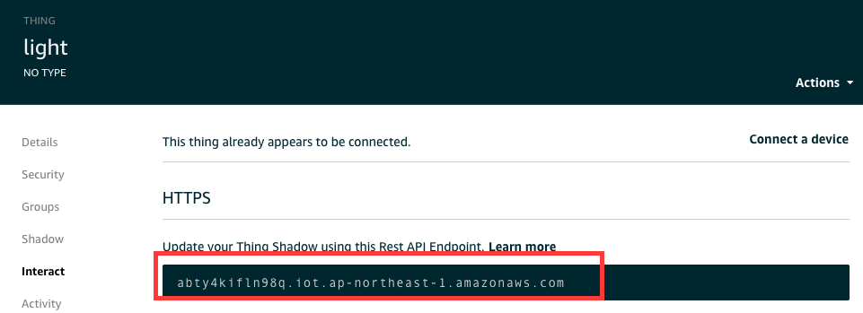
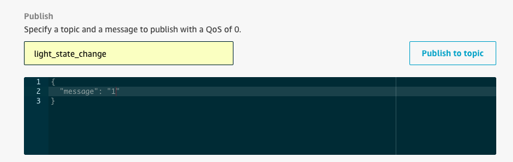

前提条件：
======
使用具有IOT服务权限的用户登陆

实验说明
--------
* 实验目的：熟悉使用IoT Core组件，设备接入，消息分发，设备认证

* 涉及AWS组件：
  * Device Gateway, Message Broker
  * Device Certificate, IoT Policy
  * AWS IoT Test Tool

* 实验流程
  * 注册IoT设备到AWS IoT服务上并下发相关证书
  * 启动IoT设备端相关代码，测试消息的推送和接收

一.进入IOT服务
--------

进入IOT Core service 如下图所示


二.创建IOT中个的物（thing）
--------

#### 1.创建物
1. 进入IOT 服务后，点击左侧列表Manage->Things,进入下述界面. 点击Register thing


2. 此界面，实际环境下我们通常选择注册多个事物，此处为了演示，我们选择create a single thing.


3. 进入如下列表后, 输入对于本地设备的命名, 比如light, 其他保持默认点击下一步.

   

#### 2.生成证书

1. 此页面点击create certificate


2. 得到如下证书, 分别下载3个证书到本地，以及根证书，准备之后客户端（树莓派）与云端建立加密通信所用


下载完后，还需要点击左下角的激活

#### 3.设置device相应的权限（Policy）
1. 左侧TAB，选择Secure->Policies，点击Create创建policy. 输入policyName,例如: lightdevie_policy,然后如下图所示


2. 点击上图add statements中的advanced mode，使用json模版为设备添加权限。复制如下的数据到命令行中

```json
{
  "Version": "2012-10-17",
  "Statement": [
    {
      "Effect": "Allow",
      "Action": [
        "iot:Publish",
        "iot:Subscribe",
        "iot:Connect",
        "iot:Receive"
      ],
      "Resource": [
        "*"
      ]
    },
    {
      "Effect": "Allow",
      "Action": [
        "iot:GetThingShadow",
        "iot:UpdateThingShadow",
        "iot:DeleteThingShadow"
      ],
      "Resource": [
        "*"
      ]
    }
  ]
}
```
上述中的主要元素有Effect,Action和Resource. 以第一条为例，Effect:Allow，表示允许操作；ACTION的中的"iot:Publish",表示允许已注册的设备向云端IoT Core发送消息；最后Resource:* 表示可以对任何云端的topic执行上述的ACTION。

* 在实际应用中，我们通常会限定设备只能发送和接受指定topic的消息，以免消息的影响

#### 4.绑定证书和policy

点击左侧tab，Secure->Certificates，选中刚刚创建的Certificates. 进入Certificate详细界面后，选择attach policy，如下图所示
选择上一步中创建的 lightdevie_policy policy


至次，设备再AWS IOT中的注册已经结束，下面进入模拟设备运行的环节。

## 三.组装硬件设备

#### 1.串联分压电阻

将灯泡与 100 欧姆的的电阻串联在面包板上


#### 2.接入树莓派

将面包板引出的两条线一端接入树莓派的**GPIO 的 17 号**引脚，另一端接空电平


#### 3.接通树莓派电源

--------

## 四.设备运行代码，连接AWS IOT云端服务

#### 1.下载实验代码

从 [GitHub 实验仓库](https://github.com/chinalabs/aws-iot-lab-1)中下载代码

#### 2.设置证书

在代码中新建 certs 目录，将在1.中生成的证书放到 certs 目录中，放置后如下所示


#### 3.修改代码并运行

修改主运行文件index.js为如下


对与上图中的3，我们需要切换回AWS IOT主页面，点击左侧TcdAB，Manage->Things。选择刚注册的thing如light, 进入如下界面，红框即位endpoint



#### 4.上传代码到设备

1. 运行以下命令在本地将代码压缩后，上传至树莓派

```shell
$ tar -cvf demo.tar aws-iot-lab-1/
```

2. 上传完毕后采用下述的指令解压

```shell
$ tar -xvf demo1.tar
```

3. 为树莓派安装[适用于 JavaScript 的 AWS IoT 设备软件开发工具包](https://docs.aws.amazon.com/zh_cn/iot/latest/developerguide/iot-device-sdk-node.html)
4. 再进入代码目录，输入如下指令

```shell
$ npm install
```

#### 5.验证消息上传

1. 切换到AWS Iot 界面，点击左侧 Test Tab，如下图所示订阅lights_oidnline topic，此处topic只要与客户端对应即可


2. 继续返回树莓派命令行

```shell
$node index.js
```
得到如下的输出:
<br>

同时我们在Test界面看到了树莓派已上线的消息，即设备到云端的发送消息成功。 

#### 6.验证消息下发的逻辑

同样，在Test界面,并修改消息如下图所示

点击publish to topic，发现灯亮
同理，修改message的value为0，点击Publish to topic发现灯灭。

停止程序，断开电源
--------
