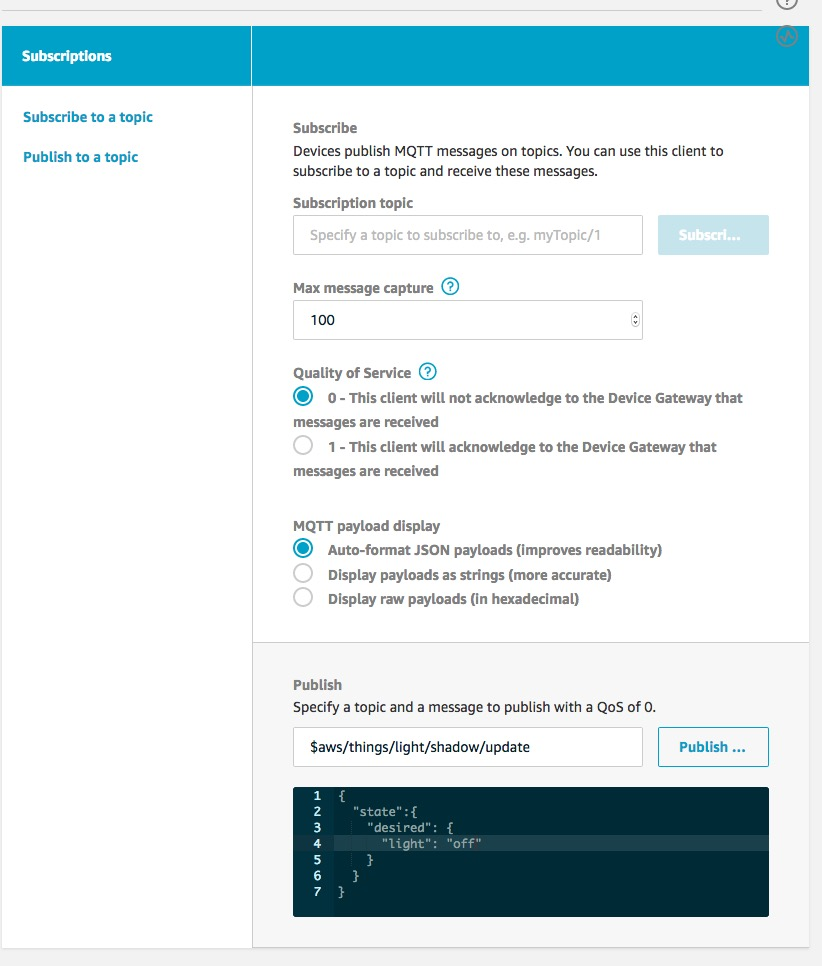
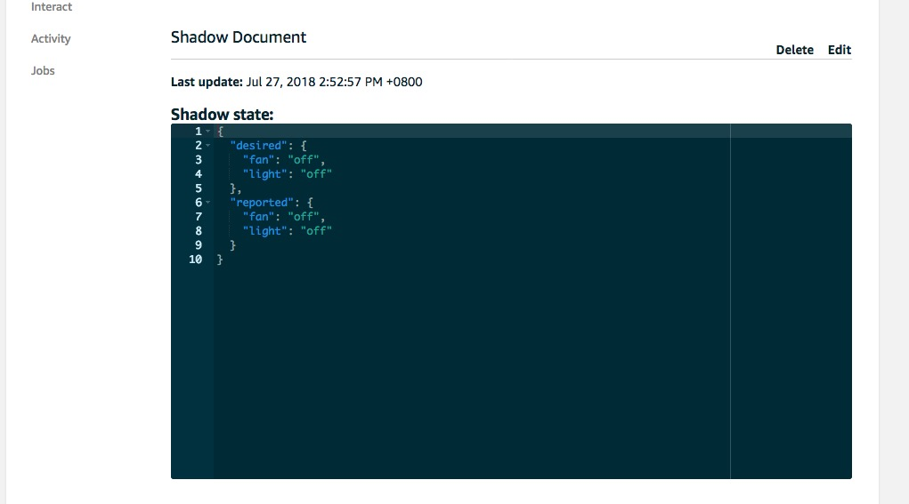
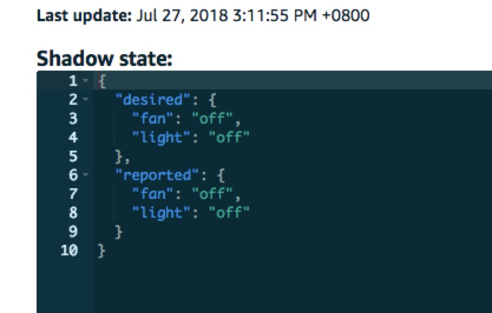
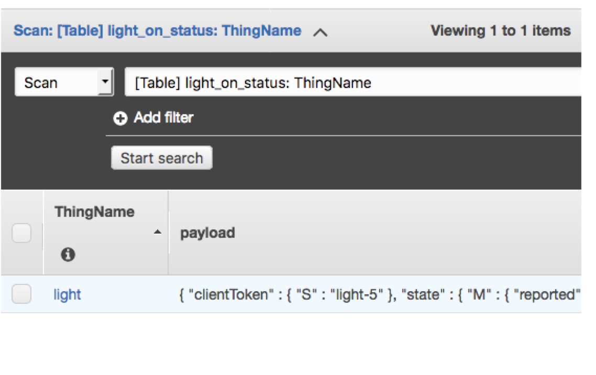

前提条件：
==========
* 完成实验1
* 创建具有Dynamodb操作权限的角色

实验说明
----------
* 实验目的：熟悉IoT Core Rule Engine, 熟悉Shadow状态机，熟悉IoT设备与云端连接后的数据处理
* 涉及AWS组件：
 * IoT Core Rule Engine
 * Shadow
 * DynamoDB
 * IAM Role

一.创建DynamoDB的表格
----------------
IoT中的设备消息发送到云端后，可以触发相应的数据处理，存储流程。本实验将light设备中的状态都存储到Dynamodb数据库中。

进入DynamoDb服务，表格如下所示，点击创建，除了名字以外都选择默认。(主键 thingname？)

- **Table name**：**light_record**
- **Partition key**：**ThingName**，类型为**String**
- **其他保持默认**


点击进入Item栏，我们发现现在是没有Item的。

二.配置Rule Engine
----------------
进入AWS IOT主界面，点击Act，然后点击右上角Create按钮。进入创建页面后，如下图所示进行设置，名字与描述可以自定义

- **Name**：**light_on_status**（可自定义）
- **Desrrlption**：自定义
- **Attribute**：**\***
- **Topic filter**：**$aws/things/light/shadow/update**
- **其他保持默认**


最后点击 Add action，选择insert a message to DynamoDb Table。插入规则如下图所示

- **Table Name**：选择之前创建的**light_record**
- **Hash key**：已被固定为**ThingName**
- **Hash key type**：已被固定为**STRING**
- **Hash key value**：**${topic(3)}**
- **Write message data to this column**：**payload**
- **其他保持默认**


此时，需要建立一个IOT服务能够访问DynamoDB数据库的Role，选择在前提条件中创建的Role，点击add action。
* 对于更多的关于写入DynamoDB的规则可参考：
[Sql for DDB](https://docs.aws.amazon.com/iot/latest/developerguide/iot-rule-sql-version.html)
* 对于Rule Engine更多的信息可参见：
[Rule engine](https://docs.aws.amazon.com/iot/latest/developerguide/iot-rules.html)

三.测试设备与云端通信
----------------
#### 1.上传代码到设备

与[实验一](lab1.IoTCore.1.md)相同，组装硬件设备，从 [GitHub 实验仓库](https://github.com/chinalabs/aws-iot-lab-1)中下载并修改代码，再将代码上传至设备。

#### 2.测试准备
首先，在原有两个界面的基础上，再打开一个AWS IOT界面。三个界面分别为:
  * 界面1: 树莓派命令行界面

    

  * 界面2: AWS IOT Test界面

    

  * 界面3: AWS IOT Manage->Thing->light->shadow

    
#### 3.测试利用Device shadow进行设备控制

切换到界面2，发送如下的消息到topic: **$aws/things/light/shadow/update**
```json
{
  "state":{
    "desired": {
      "light": "on"
    }
  }
}
```
观察到灯（风扇）已亮，


同时观看界面3，发现如下所示


说明设备已经接受到了模拟的开启指令（实际场景中，发送命令的可能是手机或者其他智能终端产片），并且报告了自身当前已亮的消息，更新device shadow状态信息。再次在界面2发送消息到相同的topic
```json
{
  "state":{
    "desired": {
      "light": "off"
    }
  }
}
```
发现灯已灭,

同时界面3得到如下的输出



说明设备已经接受到了关闭指令，并且报告了自身当前已灭的消息，更新了对应的device shadow。可以继续尝试如下topic，进行当前状态信息的查询
$aws/things/light/shadow/get

#### 4.测试Rule engine的效果

我们在步骤1中设置了rule engine的规则，即把对应于灯泡开关的信息，进行记录。那么我们现在去查询我们对应的dynamodb数据库，可以发现其中已经插入了信息。主键为物的名称，payload列为每条灯泡（风扇）开关的具体指令。



实验结束
------
