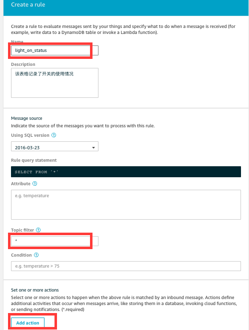

前提条件：
==========
* 完成实验1
* 创建具有Dynamodb操作权限的角色

实验说明
----------
* 实验目的：熟悉IoT Core Rule Engine, 熟悉Shadow状态机，熟悉IoT设备与云端连接后的数据处理
* 涉及AWS组件：
 * IoT Core Rule Engine
 * Shadow
 * DynamoDB
 * IAM Role

一.创建DynamoDB的表格
----------------
IoT中的设备消息发送到云端后，可以触发相应的数据处理，存储流程。本实验将light设备中的状态都存储到Dynamodb数据库中。

进入DynamoDb服务，表格如下所示，点击创建，除了名字以外都选择默认。


点击进入Item栏，我们发现现在是没有Item的。

二.配置Rule Engine
----------------
进入AWS IOT主界面，点击Act，然后点击右上角Create按钮。进入创建页面后，如下图所示进行设置，名字可以自定义


最后点击 Add action，选择insert a message to DynamoDb Table。插入规则如下图所示


此时，需要建立一个IOT服务能够访问DynamoDB数据库的Role，选择在前提条件中创建的Role，点击add action。
* 对于更多的关于写入DynamoDB的规则可参考：
[Sql for DDB](https://docs.aws.amazon.com/iot/latest/developerguide/iot-rule-sql-version.html)
* 对于Rule Engine更多的信息可参见：
[Rule engine](https://docs.aws.amazon.com/iot/latest/developerguide/iot-rules.html)

三.测试设备与云端通信
----------------
#### 1.上传代码到设备
由于本次试验采用的为nodejs,所以要求树莓派上需要有node的运行环境, 并且将代码包demo2.tar进行上传
上传完毕后采用下述的指令解压
```shell
$ tar -xvf demo2.tar
```
上传在实验1中生成的证书到代码的同级目录，放置后如下所示:
```shell
pi@raspberrypi:~/Application/aws-smarthome-light-shadow/aws-smarthome-air-purifier/certs $ ls -l
total 16
-rw-r--r-- 1 pi pi 1758 Jun  7 15:45 ca.pem
-rw-r--r-- 1 pi pi 1220 Jun  7 15:23 certificate.pem.crt
-rw-r--r-- 1 pi pi 1679 Jun  7 15:23 private.pem.key
-rw-r--r-- 1 pi pi  451 Jun  7 15:23 public.pem.key
```
其中aws-smarthome-air-purifier 为代码解压目录
#### 2.修改代码并运行
修改index.js主程序如下图所示：<br>


切换到AWS IOT主页面，点击左侧TAB，Manage->Things。选择刚注册的thing 如light, 进入如下界面，红框即位上图3所需的端点（endpoint）


返回树莓派命令行，下载node的相关依赖包，输入如下指令
```shell
$ npm install
```
#### 3.测试准备
首先，在原有两个界面的基础上，再打开一个AWS IOT界面。三个界面分别为:
  * 界面1: 树莓派命令行界面
  * 界面2: AWS IOT Test界面
  * 界面3: AWS IOT Manage->Thing->light->shadow
#### 4.测试设备注册
在树莓派界面执行下述程序。
```shell
$node index.js
```
得到设备已成功注册的返回。

返回测试准备中的界面3。查看到Device shadow已经接受到了树莓派注册的初始信息. 
#### 5.测试利用Device shadow进行设备控制
切换到界面2，发送如下的消息到topic: $aws/things/light/shadow/update
```json
{
  "state":{
    "desired": {
      "light": "on"
    }
  }
}
```
观察到灯（风扇）已亮，同时观看界面3，发现如下所示
```json
{
  "state":{
    "desired": {
      "light": "on"
    },
    "reported": {
      "light": "on"
    }
  }
}
```
说明设备已经接受到了模拟的开启指令（实际场景中，发送命令的可能是手机或者其他智能终端产片），并且报告了自身当前已亮的消息，更新device shadow状态信息。再次在界面2发送消息到相同的topic
```json
{
  "state":{
    "desired": {
      "light": "off"
    }
  }
}
```
发现灯已灭，同时界面3得到如下的输出
```json
{
  "state":{
    "desired": {
      "light": "off"
    },
    "reported": {
      "light": "off"
    }
  }
}
```
说明设备已经接受到了关闭指令，并且报告了自身当前已灭的消息，更新了对应的device shadow。可以继续尝试如下topic，进行当前状态信息的查询
$aws/things/light/shadow/get
#### 5.测试Rule engine的效果
我们在步骤1中设置了rule engine的规则，即把对应于灯泡（风扇）开关的信息，进行记录。那么我们现在去查询我们对应的dynamodb数据库，可以发现其中已经插入了数条信息。主键为物的名称，payload列为每条灯泡（风扇）开关的具体指令。

实验结束
------
