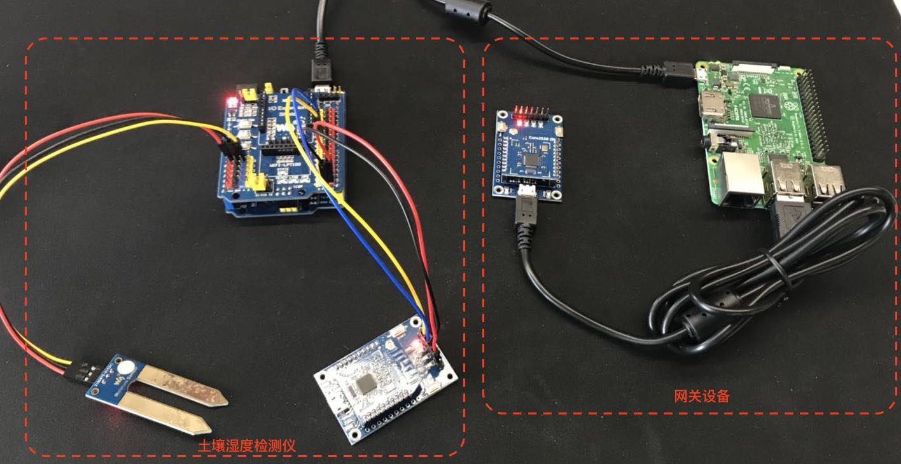
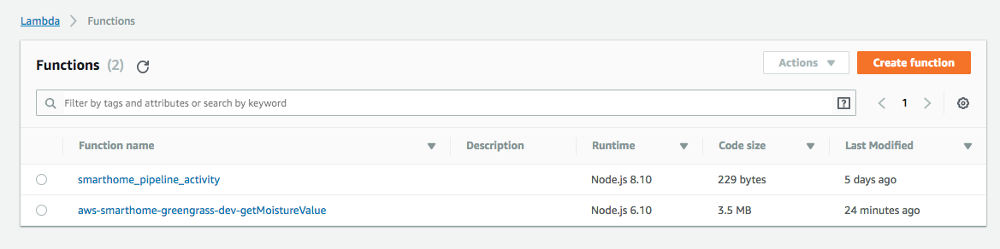
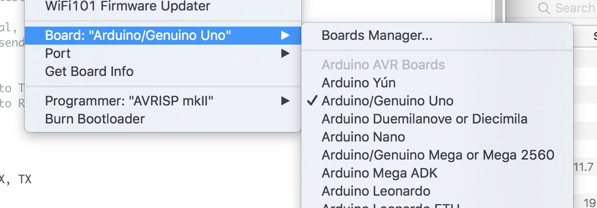
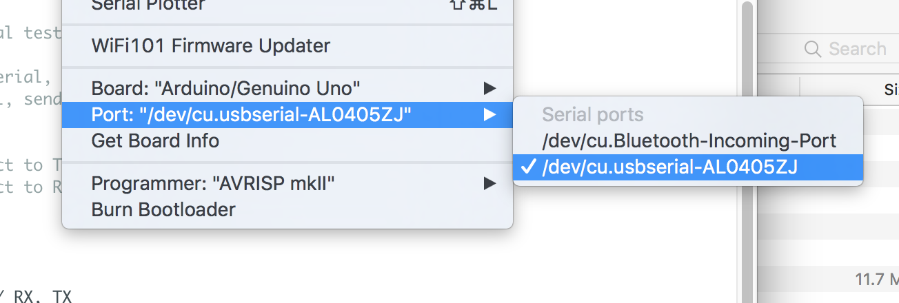
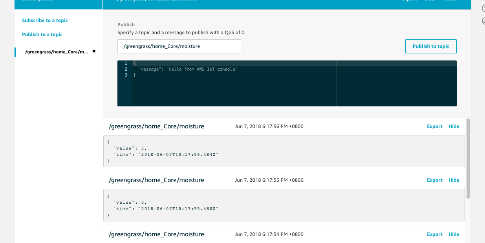

# IoT Greengrass实验

## 实验目的

了解Greengrass在IoT应用中的网关作用，了解Greengrass如何访问本地资源（e.g. 串口）及如何进行固件升级。

在本次实验中，我们将搭建如下设备：

* 土壤湿度检测仪：使用Zigbee上报土壤湿度
* 网关设备：Zigbee协议转化成MQTT, 并且将土壤湿度实时上报至云端

## 实验设备
* Raspberry Pi 3B+
* [WaveShare UNO PLUS/Arduino UNO](http://www.waveshare.net/wiki/UNO_PLUS)
* [WaveShare IO Expansion Shield](http://www.waveshare.net/shop/IO-Expansion-Shield.htm)
* [WaveShare CC2530-Eval-Kit5](http://www.waveshare.net/shop/CC2530-Eval-Kit5.htm) x 2
* [WaveShare Moisture Sensor](http://www.waveshare.net/shop/Moisture-Sensor.htm)



**设备接线如下**：

树莓派与Zigbee Coordinator直接通过USB连接树莓派；Zigbee模块与树莓派之间通过串口进行通信

湿度传感器，Zigbee模块与UNO之间引脚连线如下：

| UNO Plus/Arduino UNO | PIN           |
| ---------------------|:-------------:|
| A0                   | 湿度传感器 A0   |
| D11                  | Zigbee模块 TXD |
| D10                  | Zigbee模块 RXD |

## 实验软件

[Serverless](https://github.com/serverless/serverless): 可用户快速编写，测试，部署微服务。在该实验中，我们使用该框架进行快速开发。

请参考Serverless文档，安装并配置。

[Arduino IDE](https://www.arduino.cc/en/Main/Software?#): 用于编写Arduino程序，并烧录。


## 实验步骤
**步骤1:** [Greengrass的环境设置](https://docs.aws.amazon.com/zh_cn/greengrass/latest/developerguide/module1.html)

**步骤2:** [安装Greengrass核心软件](https://docs.aws.amazon.com/zh_cn/greengrass/latest/developerguide/module1.html)

**步骤3:** 编写Lambda函数，并利用Serverless部署到AWS Console

[下载代码](https://cdn.joeshi.im/blog/iot-series-greengrass-1/aws-smarthome-greengrass.zip)

打开`serial.js`, 将`home_Core`修改为刚才创建的设备名称

部署代码

```shell
cd aws-smarthome-greengrass

serverless deploy --region us-west-2  # deploy to Oregon region
```

打开Lambda，找到`aws-smarthome-greengrass-dev-getMoistureValue`确认Lambda部署成功



在创建部署lambda的过程中，也可以使用原生的方式进行部署Lambda, 请参考[教程](https://docs.aws.amazon.com/zh_cn/greengrass/latest/developerguide/create-lambda.html)

**步骤4:** 为AWS Greengrass配置Lambda函数

按照[教程](https://docs.aws.amazon.com/zh_cn/greengrass/latest/developerguide/config-lambda.html) 进行配置，该函数的作用是将串口接收到的数据传送到云端。

**步骤5:** 部署Greengrass

请参考[教程](https://docs.aws.amazon.com/zh_cn/greengrass/latest/developerguide/configs-core.html)，将Greengrass部署到Core设备

在部署的过程中，如果出现不成功的情况（通常情况下是未满足Greengrass的运行环境要求，程序有Bug或者内存分配过小），请参考Greengrass中的runtime.log, crash.log进行trouble shooting. 更多内容请参考[GGC问题排查](https://docs.aws.amazon.com/zh_cn/greengrass/latest/developerguide/gg-troubleshooting.html)

**步骤6:** 将湿度检测仪代码烧录到UNO

* [点击下载代码](https://cdn.joeshi.im/blog/iot-series-greengrass-1/aws-smarthome-moisture.zip)
* 将UNO的USB连接至电脑，并打开工程文件
* 选择Board为Arduino UNO, 如下图

* 选择正确的串口，如下图

* 点击【Sketch】, 选择【Upload】将程序烧录至UNO

**步骤7:** 打开AWS IoT测试工具，验证数据是否正确上传


