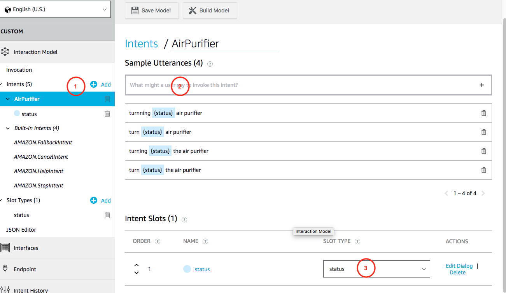

# Alexa与AWS IoT的集成

## 实验目的
熟悉Alexa Skill Set, 通过Alexa对设备进行语音控制。在开始本实验前，请先注册[Amazon Developer](https://developer.amazon.com/)账号。

## 设备
* Raspberry PI 3B+
* 小风扇（可以用LED代替）

## 软件
* Serverless: 快速开发，测试，部署Lambda

请参考Serverless文档，安装并配置。

## 部署设备软件

[点击下载设备代码](https://cdn.joeshi.im/blog/iot-serires-alexa-1/aws-smarthome-air-purifier.zip)

将代码拷贝至树莓派，并修改`index.js` 中的`ThingName`变量，将其替换为之前创建的设备；将`host`中的url替换为合法地址。

该程序启动后，会自动订阅Device Shadow的变化，并且根据变化打开或者关闭小风扇。

## 创建Alexa Skill Set

* 在[ASK Console](https://developer.amazon.com/alexa/console/ask)中点击[Create Still], 输入技能名称，选择Custom并创建技能


* 点击[Add]创建一个Slot, 输入`status`, 并且在创建`on`和`off`两个slot value


* 创建一个Intent, 按下图输入用于Intent识别的语句, 并且选择刚才创建slot



## 部署Lambda

[点击下载Alexa SkillSet代码](https://cdn.joeshi.im/blog/iot-serires-alexa-1/aws-smarthome-alexa-skill.zip)，并使用`Serverless`进行快速部署

* 打开Alexa SkillSet, 点击侧边栏中的[Endpoint]
* 找到[Your Skill ID]，并复制至剪贴板
* 打开`serverless.yml`，找到alexaSkill下面的`appID`, 将值替换成改成复制的内容
* 利用`serverless`进行快速部署
```shell
sls deploy --region us-west-2 // Oregon region
```

## Build Alexa SkillSet

* 在AWS Conole中找到刚才发布的Lambda函数，并复制arn

* 在Alexa Console中找到编辑Endpoint，将刚才复制的arn填入[Default region]

* 点击[Save Endpoint]
* 选择[Invocation], 输入Invoke Name, 点击[Save Model]，保存成功后点击[Build Model]

* 等待数秒后，Model编译成功

## 测试Alexa SkillSet

按照下图，选择[Test], 按住话筒，用英文向Alexa发送指令，例如 **ask Puppy to turn on the air purifier**


